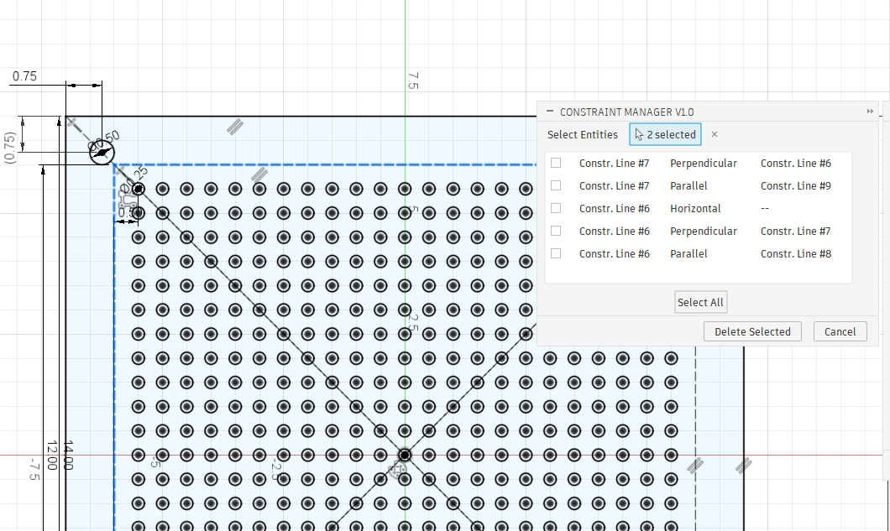

# Fusion Constraint Manager

A 100% Vibe Coded Fusion 360 add-in for viewing and selectively deleting sketch constraints. Select one or more sketch entities, see all their geometric constraints in a table, and delete the ones you don't want — without hunting through overlapping constraint icons in the viewport.



## Features

- **Multi-entity selection** — select one or many sketch entities at once
- **Unified constraint table** — see all constraints across selected entities with columns for Entity, Type, and Related To
- **Selective deletion** — check individual constraints or use Select All, then Delete Selected
- **Deduplication** — shared constraints between selected entities appear only once
- **Non-deletable constraints** shown with lock indicator for context
- **Proper undo support** — deletions committed via Fusion's command transaction

## Installation

1. Download the latest `ConstraintManager-v*.zip` from [Releases](https://github.com/mrmees/fusion-constraint-manager/releases)
2. Extract the zip — you'll get a `ConstraintManager/` folder
3. Copy it to your Fusion add-ins directory:
   ```
   %APPDATA%\Autodesk\Autodesk Fusion 360\API\AddIns\
   ```
4. In Fusion: **Tools > Scripts & Add-Ins > Add-Ins** tab
5. Find **Constraint Manager** and click **Run**
6. Optionally check **Run on Startup** to load it automatically

## Usage

1. Enter sketch edit mode (double-click a sketch or create a new one)
2. Click the **Constraint Manager** button in the toolbar (UTILITIES panel)
3. Click one or more sketch entities (lines, arcs, circles, points, etc.)
4. The table populates with all geometric constraints on the selected entities
5. Check the constraints you want to remove (or click **Select All**)
6. Click **Delete Selected** to remove them, or **Cancel** to close without changes

## Project Structure

```
ConstraintManager/
├── ConstraintManager.py              # Add-in entry point (run/stop)
├── ConstraintManager.manifest        # Add-in metadata
├── commands/
│   └── constraint_manager/
│       ├── command.py                # Command UI, event handlers
│       └── constraint_engine.py      # Pure logic: enumeration, naming, deletion
├── resources/
│   └── constraint_manager/
│       ├── 16x16.png                 # Toolbar icon
│       └── 32x32.png
└── tests/
    └── test_constraint_engine.py     # Unit tests (run with pytest outside Fusion)
```

## Development

The constraint engine (`constraint_engine.py`) is pure logic with no Fusion UI dependencies. It can be tested outside Fusion:

```bash
pip install pytest
python -m pytest ConstraintManager/tests/ -v
```

The command module (`command.py`) handles all Fusion API UI interaction and can only be tested inside Fusion.

### Key Architecture Decisions

- **`inputChanged` is UI-only** — Fusion silently discards model changes made in this event. All constraint deletions happen in the `execute` handler.
- **`entityToken` re-resolution** — constraint objects from `inputChanged` go stale by the time `execute` fires. We store `entityToken` strings and re-resolve via `Design.findEntityByToken()`.
- **Module-level state** — class attributes on event handler classes don't survive between Fusion events. Shared state uses module-level globals.

## License

MIT
