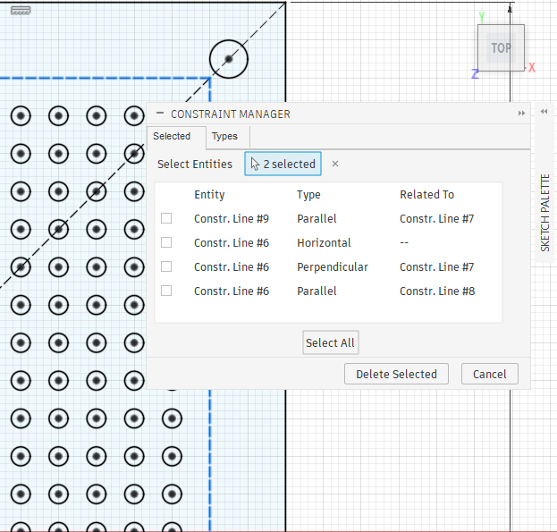
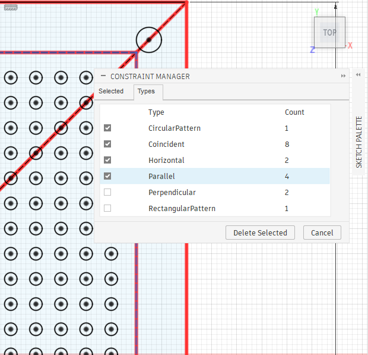
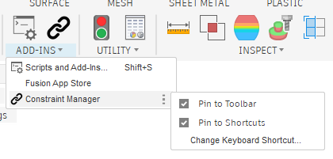

# Fusion Constraint Manager

A Fusion 360 add-in for viewing, highlighting, and bulk-deleting sketch constraints. Two-tab interface: select entities to inspect individual constraints, or switch to the Types tab to see every constraint type in your sketch at a glance and nuke entire categories in one click.

### Entity Selection


### Group Selection by Type


## Features

### Selected Tab (per-entity)
- **Multi-entity selection** — select one or many sketch entities at once
- **Unified constraint table** — see all constraints across selected entities with columns for Entity, Type, and Related To
- **Selective deletion** — check individual constraints or use Select All, then Delete Selected
- **Deduplication** — shared constraints between selected entities appear only once
- **Non-deletable constraints** shown with lock indicator for context

### Types Tab (sketch-wide)
- **Type summary** — every constraint type in the active sketch with its count
- **Checkbox selection** — check one or more constraint types to delete
- **Viewport highlighting** — checked types highlight associated geometry in orange
- **Bulk deletion** — Delete Selected removes all constraints of checked types
- **Empty state** — clear message when sketch has no constraints

### General
- **Proper undo support** — all deletions committed via Fusion's command transaction (Ctrl+Z to undo)
- **Lightweight** — no background processes, no auto-loading expensive operations
- **52 unit tests** — constraint engine fully tested outside Fusion

## Installation

1. Download the latest `ConstraintManager-v*.zip` from [Releases](https://github.com/mrmees/fusion-constraint-manager/releases)
2. Extract the zip — you'll get a `ConstraintManager/` folder
3. Copy it to your Fusion add-ins directory:
   ```
   %APPDATA%\Autodesk\Autodesk Fusion 360\API\AddIns\
   ```
4. In Fusion: **Tools > Scripts & Add-Ins > Add-Ins** tab
5. Find **Constraint Manager** and click **Run**
6. Pin to toolbar or assign hotkey from the Utilities Menu / Add-Ins Tab (Shift+C recommended)

   

7. Optionally check **Run on Startup** to load it automatically

## Usage

### Selected Tab — Surgical Precision
1. Enter sketch edit mode
2. Click **Constraint Manager** in the toolbar
3. Click one or more sketch entities (lines, arcs, circles, points)
4. The table shows all geometric constraints on selected entities
5. Check the ones you want to remove (or click **Select All**)
6. Click **Delete Selected**

### Types Tab — Bulk Operations
1. Enter sketch edit mode
2. Click **Constraint Manager** → switch to **Types** tab
3. Table auto-populates with every constraint type and count
4. Check the types you want to delete (geometry highlights in the viewport)
5. Click **Delete Selected** to remove all constraints of checked types

**DXF/SVG import tip:** After importing geometry, open the Types tab, check "Fix", and delete — removes all auto-applied Fix constraints in one shot.

## Project Structure

```
ConstraintManager/
├── ConstraintManager.py              # Add-in entry point (run/stop)
├── ConstraintManager.manifest        # Add-in metadata
├── commands/
│   └── constraint_manager/
│       ├── command.py                # Command UI, event handlers, tab logic
│       └── constraint_engine.py      # Pure logic: enumeration, naming, deletion
├── resources/
│   └── constraint_manager/
│       ├── 16x16.png                 # Toolbar icon
│       └── 32x32.png
└── tests/
    └── test_constraint_engine.py     # Unit tests (run with pytest outside Fusion)
```

## Development

The constraint engine (`constraint_engine.py`) is pure logic with no Fusion UI dependencies. It can be tested outside Fusion:

```bash
pip install pytest
python -m pytest ConstraintManager/tests/ -v
```

The command module (`command.py`) handles all Fusion API UI interaction and can only be tested inside Fusion.

### Key Architecture Decisions

- **Two-tab UI** — Selected (per-entity) and Types (sketch-wide), covering the highest-impact use cases without performance risk.
- **`APITabBar` for tab detection** — Fusion fires `inputChanged` with `id="APITabBar"` on tab switch (undocumented but universal pattern). Check `tab.isActive` to determine which tab is now showing.
- **`executePreview` for highlighting** — CustomGraphics overlays drawn in `executePreview` handler with `isValidResult=False` for visual-only preview that doesn't interfere with deletion.
- **`inputChanged` is UI-only** — Fusion silently discards model changes in this event. All constraint deletions happen in the `execute` handler.
- **`entityToken` re-resolution** — constraint objects from `inputChanged` go stale by `execute`. Store `entityToken` strings and re-resolve via `Design.findEntityByToken()`.
- **Module-level state** — class attributes on event handler classes don't survive between Fusion events. Shared state uses module-level globals with `_wire_handler()` utility for GC protection.
- **Reverse iteration for bulk delete** — Fusion collections re-index on `deleteMe()`, so forward loops skip ~50% of targets. Always iterate in reverse.

## License

MIT
